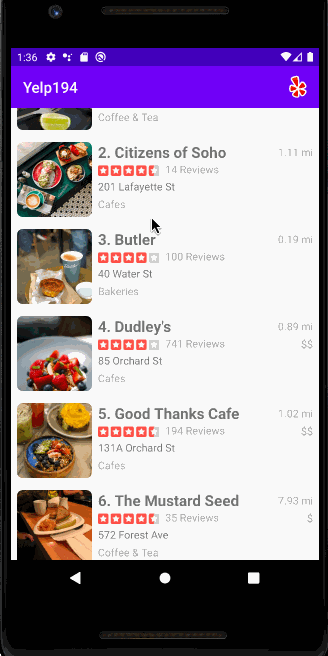

# HW3-Yelp

## *Amita Gondi*

**Yelp194** displays a list of search results from the Yelp API and displays the results in a scrollable list. 

Time spent: **6** hours spent in total

## Functionality 

The following **required** functionality is completed:

* [x] Ability to query the Yelp API to get results from a search query
* [x] The search results are displayed in a RecyclerView

The following **extensions** are implemented:
* [x] Custom description and location
* [x] Added Yelp Logo 

## Video Walkthrough

Here's a walkthrough of implemented user stories:

GIF created with [LiceCap](http://www.cockos.com/licecap/).

## Notes

Describe any challenges encountered while building the app.
For some reason, Yelp APIs and setting up an account don't work from India properly. Had to set up a VPN to circumvent the issue.

## License

    Copyright [2020] [Amita Gondi]

    Licensed under the Apache License, Version 2.0 (the "License");
    you may not use this file except in compliance with the License.
    You may obtain a copy of the License at

        http://www.apache.org/licenses/LICENSE-2.0

    Unless required by applicable law or agreed to in writing, software
    distributed under the License is distributed on an "AS IS" BASIS,
    WITHOUT WARRANTIES OR CONDITIONS OF ANY KIND, either express or implied.
    See the License for the specific language governing permissions and
    limitations under the License.

